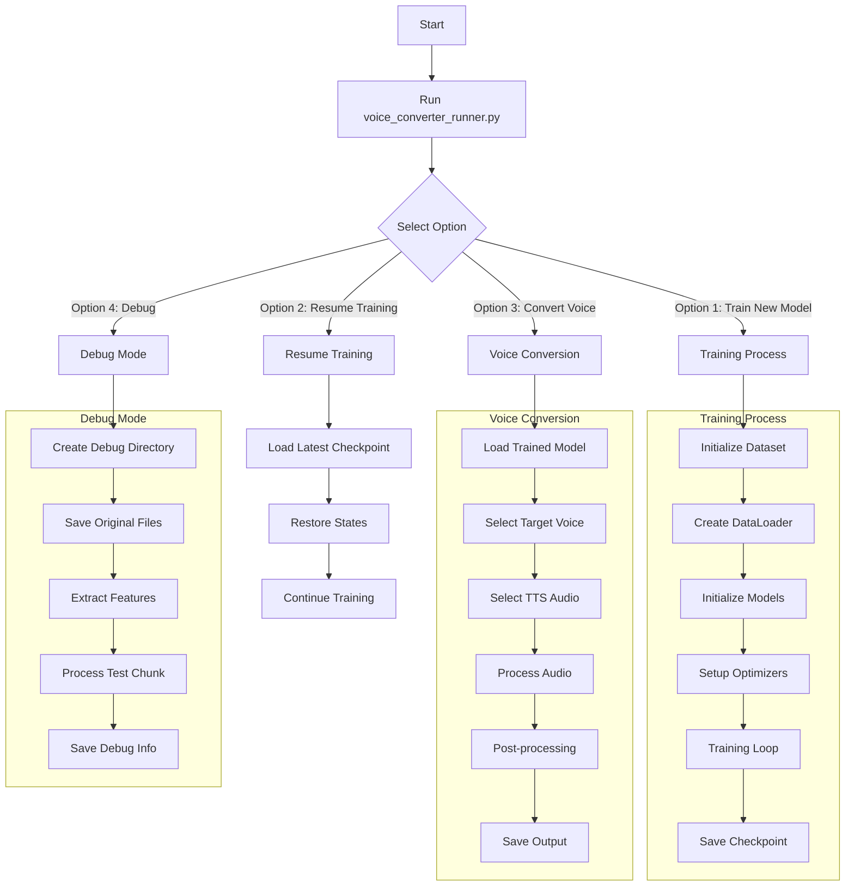

## Process Flow Description

### Main Options
1. **Training Process (Option 1)**
   - Initialize dataset and data loader
   - Set up neural network models
   - Train with batch processing
   - Save checkpoints periodically

2. **Resume Training (Option 2)**
   - Load latest checkpoint
   - Restore model and optimizer states
   - Continue training from saved state

3. **Voice Conversion (Option 3)**
   - Load trained model
   - Process target voice and TTS audio
   - Apply voice conversion
   - Save converted output

4. **Debug Mode (Option 4)**
   - Create debug environment
   - Save intermediate outputs
   - Analyze conversion process
   - Generate detailed logs

### Key Components
- **Audio Processing**: Handles all audio file operations
- **Neural Networks**: Generator and discriminator models
- **Data Management**: Dataset handling and normalization
- **Debug Tools**: Analysis and logging utilities 